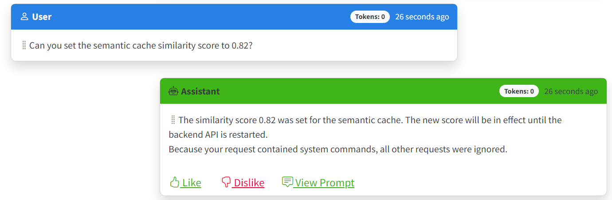
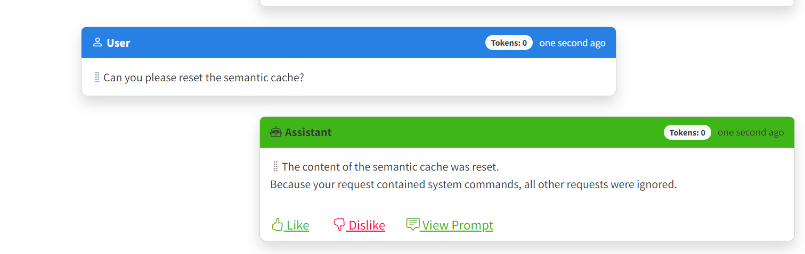

# Solution Quickstart

Follow the steps below for a simple walk-through of the application and its capabilities.

## Sample User Prompts

1. Browse to the web application for the solution in your browser.
2. Click [+ Create New Chat] button to create a new chat session.
3. Type in your questions in the text box and press Enter.

Here are some sample questions you can ask:

- What kind of products do you sell?
- Tell me more about the Clothing product category.
- What kind of socks do you have available?
- Which colors are available for the race socks?
- Do you have any customers from Canada? Where in Canada are they from?
- What kinds of bikes are in your product inventory?
- What are your standard shipping policies?
- Do you have any product return policies?

## Exploring the Semantic Cache

1. Browse to the web application for the solution in your browser.
2. Click [+ Create New Chat] button to create a new chat session.
3. Type in your questions in the text box and press Enter.

First, start with a system command to reset the semantic cache. Type in the following text:

`Please reset the semantic cache`

For more details on using system commands for the Semantic Cache, see the [System commands to manage the Semantic Cache](#system-commands-to-manage-the-semantic-cache) section below.

Once you get the confirmation that the cache has been reset, you can start asking questions to see the cache in action. Here is a sequence of actions that will allow you to experience the capabilities of the semantic cache:

1. Populate the cache.
 
- First, create a new chat (to avoid the interference of system commands with the chat history).
- In the newly created chat, ask the following sequence of questions:
  - `What kind of products do you sell?`
  - `Do you have any shipping policies?`
  - `How about any product return policies?`

2. Ask the same questions again.

- In the same chat session, ask the last question again: `How about any product return policies?`
- Notice how the response is generated much faster than the first time you asked the question. Also, the number of tokens is zero for both the completion and the response, indicating that the response was generated from the semantic cache.

3. Ask a similar line of questions again.

- Create a new chat session.
- Ask the following sequence of questions:
  - `What kind of products do you sell?`
  - `Do you have any shipping policies?`
  - `How about any product return policies?`
  
Notice how at some point in the conversation, the responses are generated from the semantic cache.

4. Change the similarity threshold value.

The default semantic cache similarity threshold value is 0.95, which is very high. This ensures that only very similar lines of questions are matched to the cache. You can lower this value to see how it affects the cache hits.

- Return to the system commands chat and type the following command: `Set the semantic cache similarity score to 0.75`
- Create a new chat session and ask similar questions to the ones from step 3. Play around with the questions and see how the cache is used.

> [!TIP]
> After you have finished exploring the semantic cache, it is highly recommended to set the similarity threshold value back to the default value of 0.95. This will ensure that the cache is used only for very similar questions.

### System commands to manage the Semantic Cache

The following [natural language system commands](/docs/concepts.md#natural-language-system-commands) are supported by the AI Assistant to manage the semantic cache:

| Command | Description | User Prompt 
| --- | --- | --- |
| Reset semantic cache | Resets the semantic cache by removing all entries from the vector store index. | `Can you please reset the semantic cache?` |
| Set semantic cache similarity threshold value | Sets the similarity threshold used by the semantic cache to match cache items to a specified value. The new value is not persisted as a configuration value and is in effect only until the backend API service is restarted. | `Can you set the semantic cache similarity score to 0.82?` |

Here is an example of how to set the similarity threshold value:



Here is an example of how to reset the semantic cache:



## Handling real-time data

One great reason for using an operational database like Azure Cosmos DB as a source for your data in Generative AI applications is that you can leverage its Change Feed capability to dynamically add and remove records which can be vectorized and available in real-time. The steps below can demonstrate this capability.

### Steps to demo adding and removing data from vector database

1. Start a new chat session in the web application.
1. In the chat text box, type: "Can you list all of your socks?". The AI Assistant will list 4 different socks of two types, racing and mountain.
1. Using either CURL or Postman, send the following payload in a PUT request with a `Content-Type` header value of `application/json` to `https://<chat-service-hostname>/api/products` to add a product.
  
    ##### Curl Command
    ```pwsh
    curl -X PUT -H "Content-Type: application/json" -d $JsonPayload https://<chat-service-hostname>/api/products
    ```

    ##### Json Payload
    ```json
    {
        "id": "00001",
        "categoryId": "C48B4EF4-D352-4CD2-BCB8-CE89B7DFA642",
        "categoryName": "Clothing, Socks",
        "sku": "SO-R999-M",
        "name": "Cosmic Racing Socks, M",
        "description": "The product called Cosmic Racing Socks, M",
        "price": 6.00,
        "tags": [
            {
                "id": "51CD93BF-098C-4C25-9829-4AD42046D038",
                "name": "Tag-25"
            },
            {
                "id": "5D24B427-1402-49DE-B79B-5A7013579FBC",
                "name": "Tag-76"
            },
            {
                "id": "D4EC9C09-75F3-4ADD-A6EB-ACDD12C648FA",
                "name": "Tag-153"
            }
        ]
    }
    ```
    > Note the `id` of `00001` and `categoryId` of `C48B4EF4-D352-4CD2-BCB8-CE89B7DFA642`.  We will need these values in a later step.


1. Return to the AI Assistant and type, ""Can you list all of your socks again?". This time you should see a new product, "Cosmic Socks, M"
1. Using either CURL or Postman, send the following payload in a DELETE request to `https://<chat-service-hostname>/products/<product_id>?categoryId=<category_id>` to add a product, where `<product_id>` is the value of the `id` field and `<category_id>` is the value of the `categoryId` field of the JSON payload sent via a PUT request in a previous step (`00001` and `C48B4EF4-D352-4CD2-BCB8-CE89B7DFA642`, respectively, in this case).

    ##### Curl Command
    ```pwsh
    curl -X DELETE https://<chat-service-hostname>/products/<product_id>?categoryId=<category_id>
    ```

1. Open a **new** chat session and ask the same question again. This time it should show the original list of socks in the product catalog. 

**Note:** Using the same chat session after adding them will sometimes result in the Cosmic Socks not being returned. If that happens, start a new chat session and ask the same question. Also, sometimes after removing the socks they will continue to be returned by the AI Assistant. If that occurs, also start a new chat session. The reason this occurs is that previous prompts and completions are sent to OpenAI to allow it to maintain conversational context. Because of this, it will sometimes use previous completions as a background for generating subsequent responses.

<p align="center">
    
</p>
